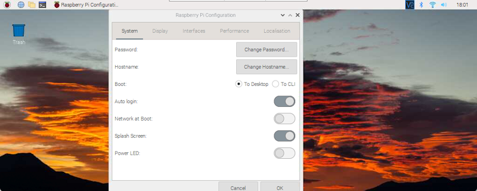
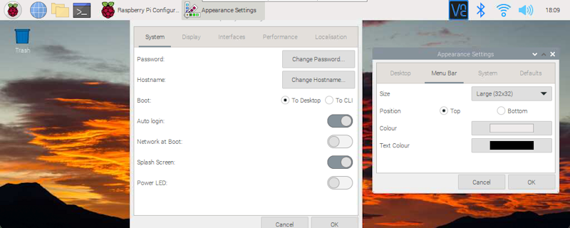
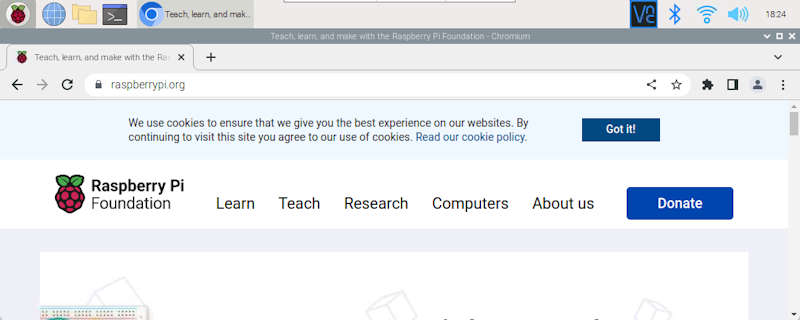

# HP\_95lx\_Pi
Rebuild of a HP95 with a Raspberry Pi Zero W stuffed in it.

<u><b>13 November 2022</b></u>

This project is just getting started and may take a year or so for me to complete. I have two other projects that I'm working on plus my full-time job and making time for family. I'm hopeful that it will not take that long but want to set expectations if anyone wants to follow this project and make your own. If you do take on this project, please fork this project and create a pull request if there is something that you want me to include.

With that said, I have made some progress thus far but before I go into the status, I would like to give some credit to some sources of inspiration and helpful information.

<b>Inspiration and References</b>

What started me down the path to build this project was a [Hackster.io interview](https://www.youtube.com/watch?v=tMHwP7T7vxs) by Alex Glow of David Groom. David was talking about the HP 95lx and 200lx palmtops. I used one for a short time but I really liked Psion Series 3 organizers so they were my go to device. I was thinking that it may be easier to stuff electronics in the HP Palmtops so I went on a search to see if I could find anyone else who had stuffed a Raspberry Pi in one and found that yes, Rune Kyndal had done just that. Hackaday.io had an article about Rune's build at [https://hackaday.io/project/172230-hpi95lx](https://hackaday.io/project/172230-hpi95lx).

One thing I wanted to see is if it would be possible to get a screen that would be the same size as the original screen, and yes, I found that too. BuyDisplay has a 4.6" display with the same dimensions and a 800x320 resolution. The display is part number [ER-TFT046-1](https://www.buydisplay.com/4-6-inch-color-bar-tft-lcd-iot-display-800x320-pixels-with-optl-touch-screen).

<b>Progress to date</b>

I purchased a dead HP 95LX on eBay. The unit was a victim of screen rot so there was no hesitation of tearing it apart for this project. A good resource that I found for disassembling the HP 95LX was by Daniel Hertrich - [Tutorial: Disassembly of HP Palmtops](https://hermocom.com/hplx/view-all-hp-palmtop-articles/14-adisassembly). The only real difficulties that I had was the thin plastic pins holding the keyboard cable in place. I broke one of those pins as they are very difficult to remove without breaking. Another area of difficulty was disassembling the display and removing the display cable. I had to fully disassemble the hinge component. I found that I had to disassemble the right hinge assembly, which Daniel clearly states do not disassemble it. I suspect that I will have difficulty getting this back together but I'm hopeful that I will not.

Besides disassembling the HP 95LX, I have been able to get the Raspbian desktop to display well on the 800x320 LCD  display. I needed to make some changes to the /boot/config.txt file. The first attempts were annoying as the screen was cutting off the top of the screen. I finally found a post, ["Bakelite" Pi Music Player with Touch Screen](https://forums.raspberrypi.com/viewtopic.php?t=162013) by BBUK, with hdmi timings for a 800x320 display. I gave those settings a go and had better success but needed to make a few tweaks.

<i>/boot/config.txt changes to get the display working</i>

<pre>
overscan_top=160
framebuffer_width=800
framebuffer_height=320
hdmi_force_hotplug=1
hdmi_group=2
hdmi_mode=87
hdmi_timings=800 0 40 48 40 480 0 13 3 29 0 0 0 62 0 30000000 6
</pre>

<i>NOTE: make certain that disable_overscan is not set to 1. Comment the line "disable_overscan=1" if it exists. (Change to "# disable_overscan=1")</i>

I wanted to see if it was possible to increase the resolution a bit past the 800x320 to allow applications such as the Raspberry Pi Configuration utility to fit on the screen. I did that by increasing the size of the framebuffer settings. Below is the updated config.txt file changes.

<i>/boot/config.txt changes to allow full screen height for the Raspberry Pi Configuration utility</i>

<pre>
overscan_top=160
framebuffer_width=1024
framebuffer_height=410
hdmi_force_hotplug=1
hdmi_group=2
hdmi_mode=87
hdmi_timings=800 0 40 48 40 480 0 13 3 29 0 0 0 62 0 30000000 6
</pre>

<i>My full final /boot/config.txt</i>

<pre>
# For more options and information see
# http://rpf.io/configtxt
# Some settings may impact device functionality. See link above for details

# uncomment if you get no picture on HDMI for a default "safe" mode
#hdmi_safe=1

# uncomment the following to adjust overscan. Use positive numbers if console
# goes off screen, and negative if there is too much border
#overscan_left=-224
#overscan_right=-112
overscan_top=160
#overscan_bottom=-280

# uncomment to force a console size. By default it will be display's size minus
# overscan.
framebuffer_width=1024
framebuffer_height=410

# uncomment if hdmi display is not detected and composite is being output
#hdmi_force_hotplug=1

# uncomment to force a specific HDMI mode (this will force VGA)
#hdmi_group=1
#hdmi_mode=1

# uncomment to force a HDMI mode rather than DVI. This can make audio work in
# DMT (computer monitor) modes
#hdmi_drive=2

# uncomment to increase signal to HDMI, if you have interference, blanking, or
# no display
#config_hdmi_boost=4

# uncomment for composite PAL
#sdtv_mode=2

#uncomment to overclock the arm. 700 MHz is the default.
#arm_freq=800

# Uncomment some or all of these to enable the optional hardware interfaces
#dtparam=i2c_arm=on
#dtparam=i2s=on
#dtparam=spi=on

# Uncomment this to enable infrared communication.
#dtoverlay=gpio-ir,gpio_pin=17
#dtoverlay=gpio-ir-tx,gpio_pin=18

# Additional overlays and parameters are documented /boot/overlays/README

# Enable audio (loads snd_bcm2835)
dtparam=audio=on

# Automatically load overlays for detected cameras
camera_auto_detect=1

# Automatically load overlays for detected DSI displays
# display_auto_detect=1

# Enable DRM VC4 V3D driver
#dtoverlay=vc4-kms-v3d
max_framebuffers=2

# Run in 64-bit mode
arm_64bit=1

# Disable compensation for displays with overscan
# disable_overscan=1

[cm4]
# Enable host mode on the 2711 built-in XHCI USB controller.
# This line should be removed if the legacy DWC2 controller is required
# (e.g. for USB device mode) or if USB support is not required.
otg_mode=1

[all]

[pi4]
# Run as fast as firmware / board allows
arm_boost=1

[all]
hdmi_force_hotplug=1
hdmi_group=2
hdmi_mode=87
# hdmi_cvt=800 320 60 1 1 0 0
hdmi_timings=800 0 40 48 40 480 0 13 3 29 0 0 0 62 0 30000000 6
</pre>

The Raspberry Pi Configuration utility still does not fully fit on the screen but much more of it is visible and usable.

One more recommended change is to increase the size of the Menu Bar from Small (16x16) to Large (32x32). This takes away even more height off the Raspberry Pi Configuration and other windows. It shows that it will be important to implement the ALT and F7 keys on the keyboard, so we are able to move the window around with the touchscreen or mouse.

Mentioning keys to implement is the F11 key, which I do not recall being on the HP 95LX keyboard. The F11 key will be important when using the browser as it is best to view pages in fullscreen mode. We can do that from the settings but without the F11 key, it may be impossible to return to the regular window and the desktop.

<u>A bit more information on my setup</u>

I am using a Raspberry Pi 400 for testing. The HDMI from the Raspberry Pi 400 is connected to BuyDisplay's [40-50 Pins TFT LCD Display Small HDMI Driver Board for Raspberry Pi](https://www.buydisplay.com/40-50-pins-tft-lcd-display-small-hdmi-driver-board-for-raspberry-pi) (800x480 version) with the 50 to 40 Pins Adaptor Board. The display is connected to the middle 40-pin connector of the adaptor board.

<i><b>NOTE:</b> Screen captures are from VNC and resized from 1024x410 to 800x320.</i>